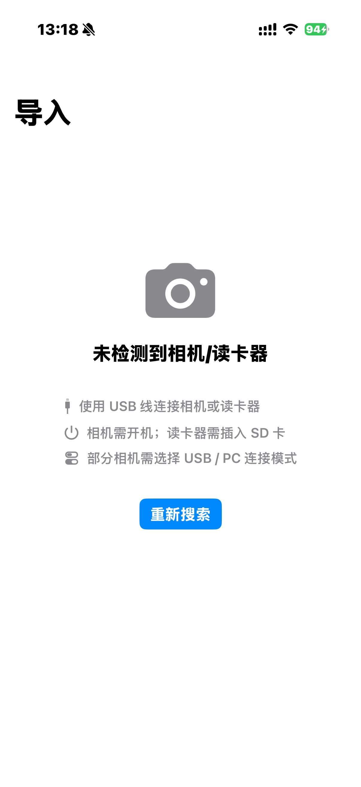
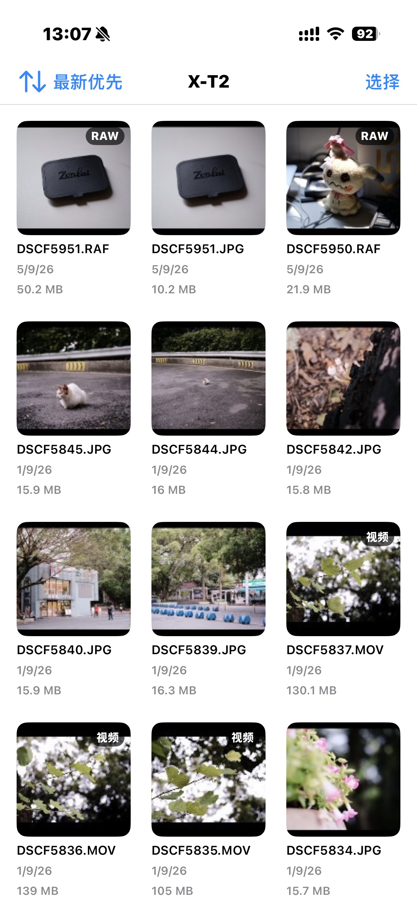
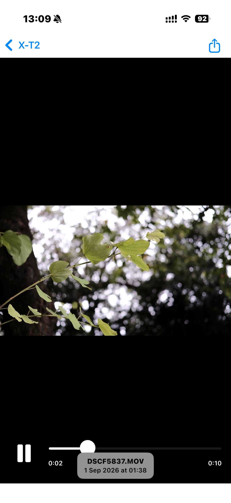
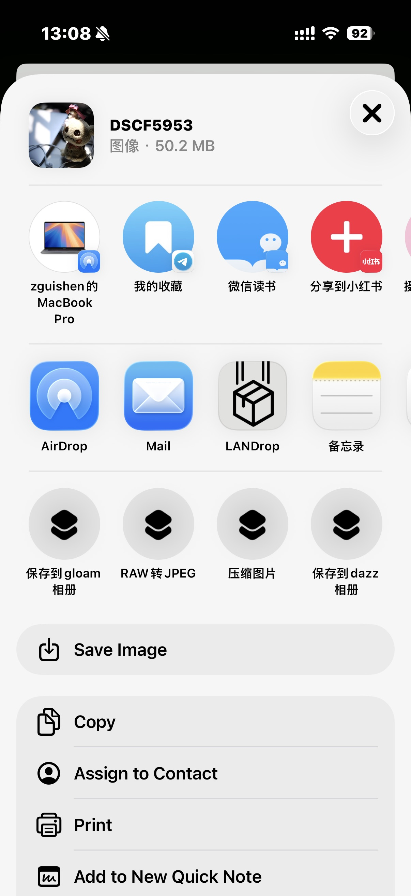

## CameraImport

### 背景
由于一些相机支持PTP图片传输协议，没有海量存储协议，在连接iPhone无法被识别为U盘，无法在文件app看到相机文件，虽然在照片app有导入的功能，但是功能过于简陋，没有排序，竖图预览被裁切成横图，视频无法预览播放，也无法使用分享功能配合快捷指令做操作。

这个项目就是做一个支持PTP协议的相机文件传输app，实现连接相机/读卡器，可大图预览播放视频预览，按时间顺序和倒序排序，可使用系统分享功能配置快捷指令做压缩或者保存到指定文件夹。

系统要求iOS17.2+，自行签名或者侧载。

### 截图

<table>
  <tr>
    <td></td>
    <td></td>
    <td></td>
    <td></td>
  </tr>
</table>

### 相关快捷指令

RAW转JPEG
https://www.icloud.com/shortcuts/49aee294b7604fb6a6fcc0ba4aeb9941

压缩图片
https://www.icloud.com/shortcuts/dd06078efbd844b3a00b60455b85b39a

保存到gloam相册
https://www.icloud.com/shortcuts/78dcae6e4201496dbda934ef8efcb516
